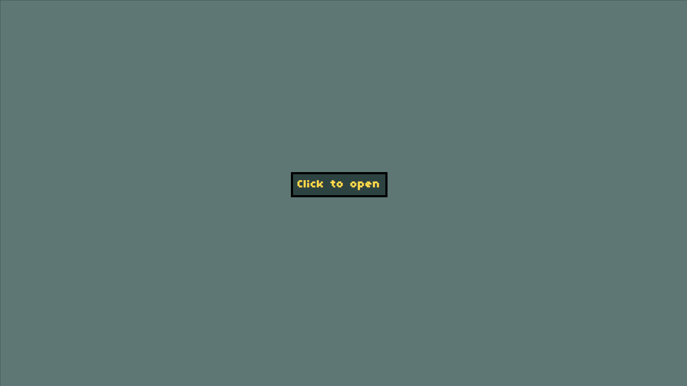

Hi there, I'm Björn Hjorth 👋

I like combining the web and game development, if you like what you see please do not be a stranger and say "Hi" on Twitter [@browsermage](https://twitter.com/browsermage)


<a href="https://pixel-ui-dialog.vercel.app/">Try live demo⚡️</a>
·
<a href="https://github.com/colorsofcode/pixel-ui-dialog/issues">Report Bug</a>

<div align="center">
   
</div>

<!-- ABOUT -->
## About The Project

Making UI for games is hard and takes a lot of time, and I wanted to explore by making game UI in regular HTML + CSS 💝

<!-- PREREQUISITES -->
## Prerequisites

* None

<!-- STARTING -->
## Getting started 

1. Clone the repo
   ```sh
   git clone git@github.com:browsermage/pixel-ui-dialog.git
   ```
2. Move to the new directory
    ```sh
    cd pixel-ui-dialog
    ```
3. Open the `index.html` in you Favorite browser
   
<!-- CONTACT -->
## Contact

Björn Hjorth - [@browsermage](https://twitter.com/browsermage)

<!-- LICENSE -->
## License

The code is distributed under the MIT License. See `LICENSE` for more information.
The pixel art spritesheet is distributed under the 
